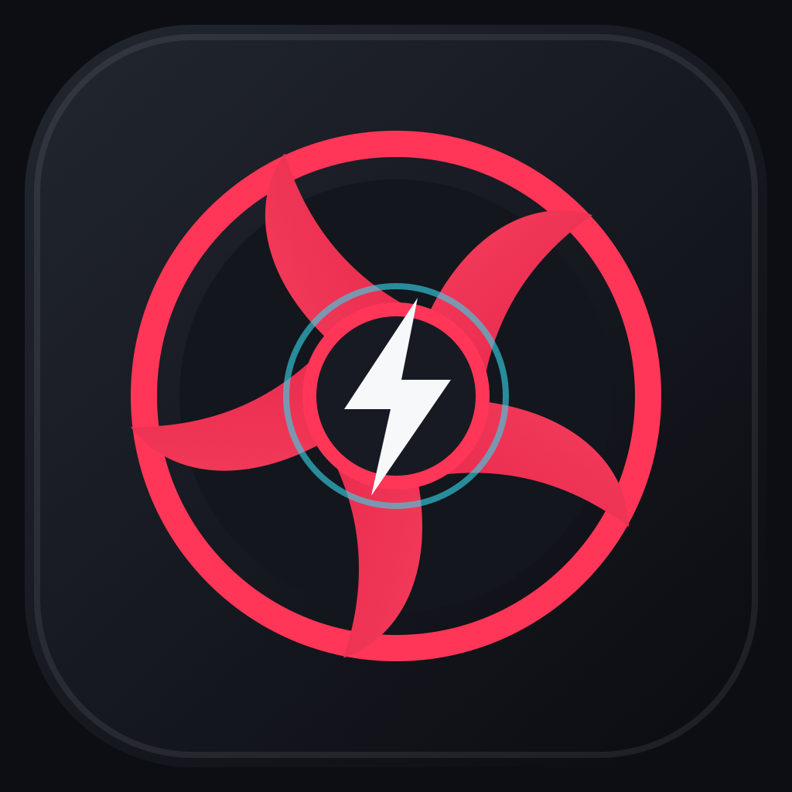

# R3 Control

<p align="center">
  
</p>

Native macOS control center for the MSI GF63 Hackintosh community.

## Current build

- Real AppleSMC CPU temperature and package-power monitoring.
- CPU, memory, disk and battery status.
- SwiftUI dashboard and menu-bar panel.
- WidgetKit small and medium desktop widgets.
- Native Liquid Glass surfaces on macOS 26 with a Material fallback on macOS 14 and 15.
- Persistent Eco, Comfort, Sport and Turbo preferences with Auto, Silent, fixed-speed Basic and Advanced fan modes.
- Editable, monotonic Advanced fan curve and a saved Cooler Boost preference.
- Saved 60%, 80% and 100% charge-limit preferences.
- Native launch-at-login support through `SMAppService`.
- Cooling, performance and battery hardware writes guarded by a read-only safety gate.

The packaged ad-hoc build is available at `Build/R3Control.app`. Open it once, then add **R3 System Status** from the macOS desktop widget gallery.

The editable vector icon source is stored at `R3Control/Assets/AppIcon.svg`; Xcode compiles the generated macOS icon set from `Assets.xcassets`.

See `MACHINE_AUDIT.md` for compatibility and testing guidance, and `ROADMAP.md` for the guarded path to real fan control.

No Embedded Controller bytes are written in version `0.1.0`. Control choices are saved locally so the complete control surface can be configured and tested, but hardware writes remain disabled until R3EC detects a firmware profile that is explicitly supported and validated for the current GF63 variant. The app always labels that distinction in the UI.

## Build

Open `R3Control.xcodeproj`, select the `R3Control` scheme and run. To use the desktop widget from a signed build, assign your Apple Development team to both targets and configure a shared App Group; the prototype also retains a local shared-preferences fallback for unsigned builds.

Command-line verification:

```sh
xcodebuild -project R3Control.xcodeproj -scheme R3Control -configuration Debug -derivedDataPath ../../work/R3ControlDerivedData CODE_SIGNING_ALLOWED=NO build
```

## Safety

The SMC bridge is read-only. Future EC support must use an exact firmware allowlist, masked writes, verification, rate limiting, sleep/crash rollback and a firmware-Auto thermal fallback.

## Licensing

Project code is provided under GPL-2.0-or-later. The AppleSMC structure layout in `SMCBridge.c` follows the public implementation used by smcFanControl; attribution and license notice are retained there.
